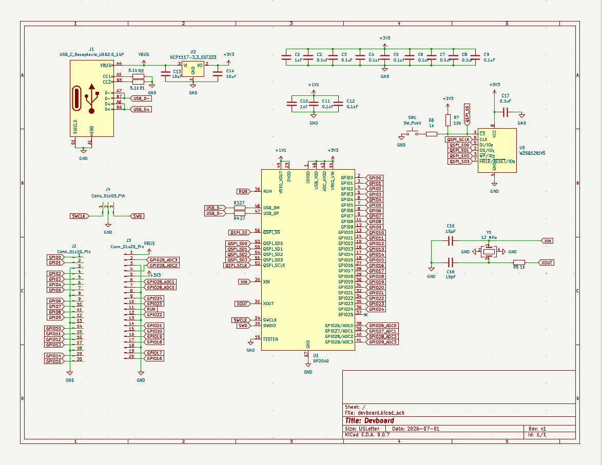

# devboard

<<<<<<< HEAD

=======

>>>>>>> 6d30a27 (change folder name)

A custom RP2040 devboard with USB-C power/programming, a 3.3V LDO regulator, 12 MHz crystal oscillator, QSPI flash storage, and BOOTSEL/SWD debug support. All GPIOs and ADC pins are broken out via 20-pin headers following the Pi Pico pinout.
